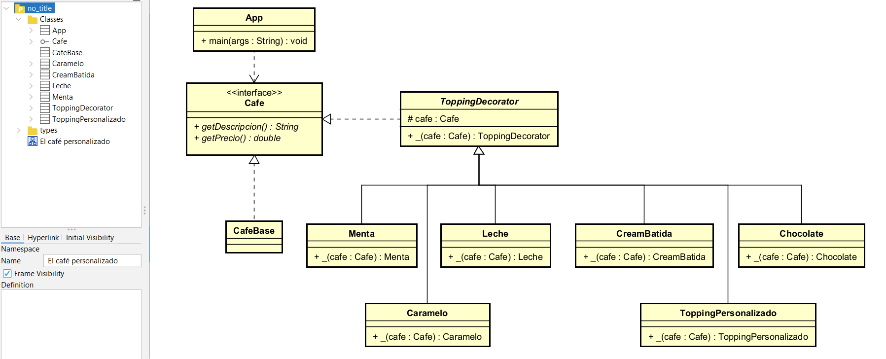

# ☕ Reto #5 – Café Personalizado

## Descripción

Este proyecto simula una cafetería donde el usuario puede personalizar su café agregando diferentes toppings como leche, chocolate, caramelo, entre otros.  
Cada topping tiene un precio adicional y puede combinarse libremente con otros.

El sistema permite crear varios cafés desde consola y calcular el total general.

El proyecto fue desarrollado en Java utilizando Maven.

---

## 🧩 Patrón de Diseño Utilizado

### Patrón empleado

**Decorator**

---

### Categoría

Estructural

---

### ¿Por qué se utilizó este patrón?

Se utilizó el patrón **Decorator** porque permite agregar funcionalidades (toppings) al café de forma dinámica sin modificar la clase base.

Este patrón evita crear múltiples clases para cada combinación posible de café, como por ejemplo:
Además, permite cumplir con el principio **Open/Closed**, ya que el sistema queda abierto para agregar nuevos toppings, pero cerrado para modificar el código existente.

Gracias al uso de Decorator, es posible crear nuevos toppings simplemente añadiendo nuevas clases, sin afectar el funcionamiento del sistema actual.

---

### Modelo UML
